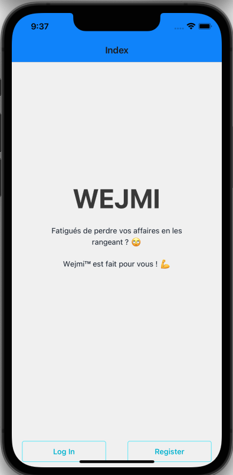
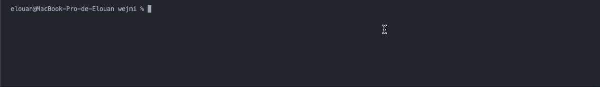
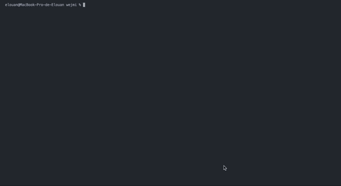

# 📱 Projet Fil Rouge - Module Dev Mobile

![react-native]
![android]
![ios]
![sqlite]
![ynov]

---

# ✨ WEJMI™ ✨

## 📝 Présentation du projet

Le projet consistait à développer une application mobile (Android et IOS) permettant de construire un annuaire contenant des objets rangés tout en précisant leurs localisations et leurs statuts (perdu, déplacé etc).

> 

## ⚙️ Fonctionnalités

Avec l'application WEJMI™, vous allez pouvoir :

-   Ajouter un objet dans votre annuaire en renseignant :
    -   Le nom
    -   La catégorie (Outil, Clé, Document ...)
    -   Une photo
    -   La pièce (Salle à manger, Chambre, Cuisine ...)
    -   Le statut (A sa place, Déplacé temporairement, Perdu)
    -   Et une brève description
-   Supprimer un objet de votre annuaire
-   Modiifier un objet de votre annuaire
-   De filtrer les objets par nom, catégorie, pièce...

### ❗️ Fonctionnalités supplémentaires

-   Gestion en base de données SQLite

Vous allez également pouvoir :

-   Vous inscrire sur l'application WEJMI™ et vous y connecter.

# 📥 Installation du projet

## Installation de NodeJS

👉🏼 `Installation de NodeJS en LTS` : https://nodejs.org/en/download/

## Téléchargement du projet

👉🏼 Téléchargement [ici](https://github.com/NatSch45/wejmi/archive/refs/heads/main.zip)

## Installation des packages

☝️ _Mettez vous à la racine du projet_

-   Commande : `npm install`

## Installation d'expo sur IOS & Android

-   Sur le **PlayStore** & **AppStore**, installer l'application `Expo Go`.

# 🎉 C'est parti !

-   Lançons le projet : `expo start`

## Sur Android :

-   Ouvrez l'application `Expo Go` et **scannez le QR Code**, celui-ci lancera le projet.

## Sur IOS :

-   Ouvrez votre `appareil photo` et **scannez le QR Code**, celui-ci vous redirigera sur `Expo Go` automatiquement en lançant le projet.

# 🔍 Architecture

| Dossiers           | Description                                              |
| ------------------ | -------------------------------------------------------- |
| components         | Les fonctions, boutons et gestion de la base de données. |
| components/screens | Toutes les pages de navigation.                          |

| Components      | Description                                                                                 |
| --------------- | ------------------------------------------------------------------------------------------- |
| Button.jsx      | Le bouton pour ajouter un nouvel objet.                                                     |
| MenuIcon.jsx    | Menu permettant de choisir l'appareil photo ou la galerie pour ajouter une image.           |
| ImagePicker.jsx | Fonction qui permet de lancer l'appareil photo ou de pacourir dans la galerie du téléphone. |
| Crud.jsx        | Toutes les fonctions liées à l'interrogation de la base de données.                         |

| Screens          | Description                                                                |
| ---------------- | -------------------------------------------------------------------------- |
| App.jsx          | Répertorie toutes les navigations possible dans l'application.             |
| Index.jsx        | Page d'accueil qui peut rediriger vers Login ou Register.                  |
| Register.jsx     | Permet de se créer un compte.                                              |
| Login.jsx        | Permet de se connecter au compte.                                          |
| Object.jsx       | Page permettant l'ajout d'un nouvel objet dans l'annuaire.                 |
| AddSomething.jsx | Page permettant l'ajout d'une nouvelle pièce, catégorie ou meuble.         |
| Directory.jsx    | Page contenant l'annuaire des objets.                                      |
| Preview.jsx      | Page avec un objet en particularité avec les informations supplémentaires. |

# 🎥 Démonstration

-   👉 [Démo]() (Coming soon)

# 👥 Équipe

-   `Elouan DUMONT` alias [@ByMSRT](https://github.com/ByMSRT)
-   `Nathan SCHNEIDER` alias [@NatSch45](https://github.com/NatSch45)
-   `Malo LOYER VIAUD` alias [@Karrwolf](https://github.com/Karrwolf)

---

_Nantes YNOV Campus - B2 Informatique - 2021/2022_

_Projet Fil Rouge - Wejmi - Par Julien SOSTHENE - 2022_

---

<!-- Var -->

[react-native]: https://img.shields.io/badge/React_Native-20232A?style=for-the-badge&logo=react&logoColor=61DAFB
[android]: https://img.shields.io/badge/Android-3DDC84?style=for-the-badge&logo=android&logoColor=white
[ios]: https://img.shields.io/badge/iOS-000000?style=for-the-badge&logo=ios&logoColor=white
[sqlite]: https://img.shields.io/badge/SQLite-07405E?style=for-the-badge&logo=sqlite&logoColor=white
[ynov]: https://img.shields.io/badge/Ynov22-B2--Info-blue?style=for-the-badge&logo=appveyor
